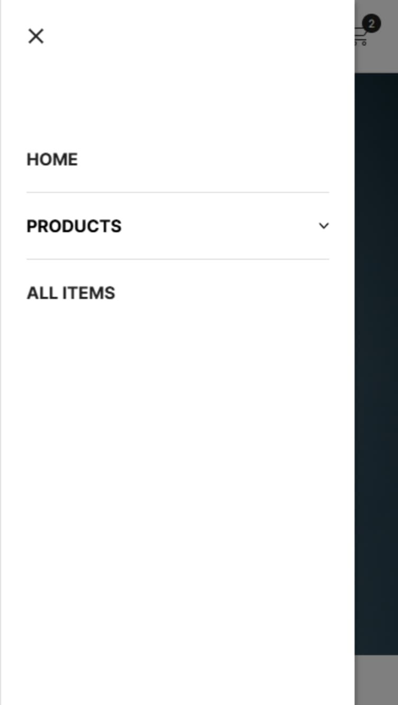
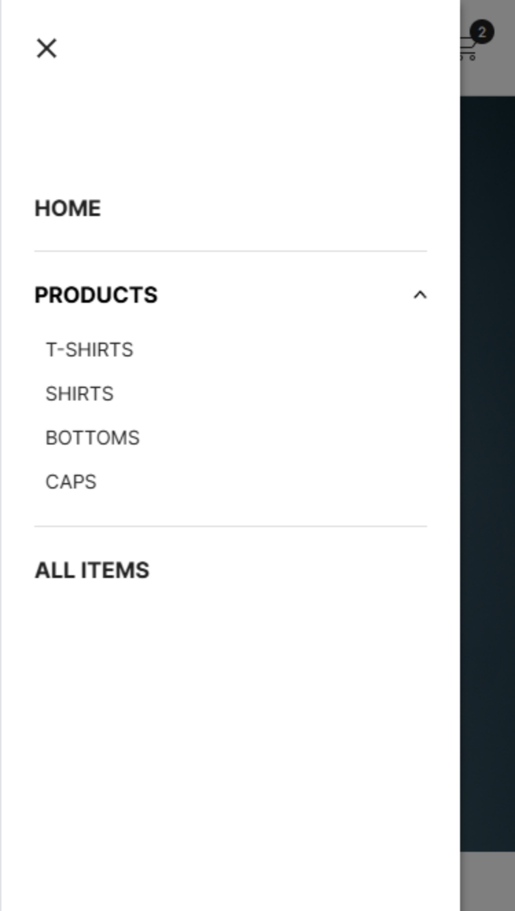

# ONEPLUS

## 概要

このリポジトリは、Next.js（App Router）と TypeScript を用いて構築した、仮想のメンズアパレルECサイト「ONEPLUS」の実装例です。  
現在の実務ではWordPressが中心のため、Reactベースの最新技術スタック（Next.js, Supabase, Stripe, Zustandなど）を活用した実践的なECサイトを構築し、**フロントエンド技術の証明およびポートフォリオとして可視化**することを目的としています。  
実在のブランドではありませんが、UI設計・アクセシビリティ・デザイン面にも配慮しています。  
**Jamstack構成で本番想定のECサイトを構築する技術力**を表現しています。

## 技術スタック

- Next.js 14.1.4（App Router）
- TypeScript
- Supabase（データベース、認証、ストレージ）
- Stripe （決済機能・テストモード）
- Zustand （カート状態の管理）
- CSS Modules
- React Hooks
- HTML / WAI-ARIA（アクセシビリティ対応）
- Node.js（開発環境）

## 主なディレクトリ構成

```
src/
├── app/
│   ├── _components/         # 共通UIコンポーネント群（ヘッダー、ドロワー、ボタンなど）
│   ├── _constants/          # 定数やナビゲーションデータなど
│   ├── _hooks/              # カスタムフック群（フォーカストラップや背景固定など）
│   ├── _store/              # Zustandによる状態管理（カート機能周り）
│   ├── api/                 # SupabaseやStripe関連のAPI関数
│   ├── auth/                # 認証関連ユーティリティ
│   ├── cart/                # カートページ
│   ├── check-email/         # パスワード再設定用リンク送信の案内ページ
│   ├── collections/         # 商品カテゴリページ
│   │   └── [category]/      # カテゴリ別の商品一覧ページ（動的ルーティング）
│   │       └── page.tsx
│   ├── confirm-email/       # 新規会員登録後の「アカウント有効化」案内ページ
│   ├── error/               # エラーページ
│   ├── forget/              # パスワード再設定メール申請ページ
│   ├── login/               # ログインページ（ログイン、ログアウト）
│   ├── products/            # 商品関連ページ（一覧・詳細）
│   │   ├── page.tsx         # 商品一覧ページ（全商品）
│   │   └── [slug]/          # 商品詳細ページ（動的ルーティング）
│   │       └── page.tsx     # ※内部で ProductDetail.tsx を分割して管理
│   ├── register/            # 新規会員登録ページ（サインアップ）
│   ├── reset-password/      # パスワード再設定ページ
│   ├── search/              # 商品検索ページ
│   ├── success/             # 決済完了ページ
│   └── page.tsx             # トップページ
│
├── utils/
│   └── supabase/            # Supabase関連の初期化・共通処理
│
├── middleware.ts           # Edge Middleware（Supabase セッション同期）
├── next.config.mjs
├── tsconfig.json
├── package.json
├── .env.local              # ローカル用の環境変数（`.env.example` を参考に作成／本番は Vercel に設定）
```

## 主な実装機能

- **ユーザー認証 & アカウント管理**  
   メール確認付き Sign-Up / Login / Logout / パスワード再設定（Supabase Auth）

- **商品検索機能**  
  カテゴリ名の同義語に対応したシンプルかつ高速な検索体験を実現（Supabase + PGroonga）

- **カート機能**  
  カートへの追加 / 削除 / 数量変更を Zustand でリアルタイム同期

- **決済処理**  
  Stripe Checkout を組み込み、メールアドレスとカード情報だけでワンページ決済。  
  **テストモード**のため課金は発生せず、カード番号は `4242 4242 4242 4242` を入力すれば動作確認できます。  
  決済完了後は Stripe ダッシュボードに支払いインテントが反映され、同時に注文データが Supabase の `orders` テーブルへ自動 INSERT される仕組みです。

- **アクセシブルな UI コンポーネント**  
  ドロワー・ドロップダウン・ フォーカストラップ（WAI-ARIA対応）

- **メタデータ対応**  
  各ページに動的 `<title>` / OGP / Twitter Card を設定

- **カスタムフックの活用**  
  `useEscapeToClose`, `useFocusTrap`、`useOutsideClick` など UI 制御系

## 補足事項

本プロジェクトは、実在のブランドに基づいたものではなく、**仮想のECサイトを想定して構築した技術検証用のポートフォリオ**です。  
以下の点については、実装目的の都合上、簡略化・ダミー対応となっています。

- **フッターのリンク群（よくあるご質問 / 返品ポリシー / 利用規約 等）**は、全体のデザインバランスやレスポンシブ対応を考慮して仮で設置しています。  
各リンクはダミー（すべてトップページに遷移）となっており、ページ自体の実装は行っていません。  
ただし、各ページの実装は省略していますが、**実運用を想定したUI設計・マークアップ・アクセシビリティへの配慮は適切に行っています。**
- Stripe 決済機能は**テストモードで動作**しており、実際の課金・配送処理は行われません。  
  - 注文後は Supabase に購入データが保存され、購入フローの再現・検証が可能です。
- 本プロジェクトの目的は、WordPress中心の現職とは異なり、Next.js / TypeScript / Supabase / Stripe などを活用して、**Webアプリケーションの構築スキルを証明・可視化すること**です。

## スクリーンショット

### PC

#### トップページ
<br>


---

#### 商品詳細ページ
<br>


---

#### カートページ  
<br>


---

#### 検索パネル展開  
<br>


---

### SP

| ドロワー展開 | ドロップダウン展開 |
|:--:|:--:|
|  |  |

## 使い方

### 1. まずはデモを見る
本番環境: https://oneplus-ec.vercel.app/

- 任意のメールアドレスで新規会員登録（サインアップ）が可能（確認メールが届きます）
- ログイン状態であれば、商品詳細ページやカートに商品を追加していれば、
「購入する」ボタンを押していただければStripeの決済画面に遷移します。  
決済に関してはStripeのテストモードを利用しているので、課金せず（料金発生せず）実際に商品を買うことが出来ます。

<details>
<summary>2. ローカルでコードを確認したい方向け（開発者向け）</summary>

#### 前提
- Node.js v18 以上を推奨

#### セットアップ

```bash
git clone https://github.com/markReo-code/oneplus-ec.git
cd oneplus-ec
npm install
npm run dev
```

#### 注意点
- 商品画像や認証・検索などの一部機能は Supabase 環境がないと正しく動作しません
- Stripe との連携も環境変数の設定が必要です
- .env.example を参考に .env.local を作成し、Supabase／Stripe のキーを設定することで再現可能です  
※ Supabase／Stripe のアカウント登録が必要です

</details>

## Supabase データベース構成

本プロジェクトでは、Supabase 上に以下の 3 つのテーブルを作成しています：

| テーブル名 | 概要 |
|------------|------|
| `products` | 商品データ（title / price / image / category など） |
| `orders`   | Stripe連携後に挿入される注文データ |
| `synonyms` | PGroonga を使った検索機能用の同義語データ（例: "Tシャツ" に "シャツ" を紐づけ） |

- **`products` テーブルのみ** であれば、商品一覧・商品詳細ページなどの閲覧は可能です
- **`orders` / `synonyms` テーブル** は Stripe決済・検索機能の再現に必須です
- Supabase の Table Editor（GUI）を使えば、手動で簡単に作成できます  
※検索機能に使う`synonyms` テーブル** は、PGroongaを用いた日本語全文検索ではSQL文で作成するのを推奨します

## 環境変数（Supabase / Stripe）

Stripe や Supabase の機能を再現するには、`.env.local` に以下のような環境変数を設定してください。  
下記の`.env.example` を参考にしてください。

```env
# Supabase（認証 / データベース / ストレージ）
NEXT_PUBLIC_SUPABASE_URL=https://xxxxxxxxxxxxxxxxx.supabase.co
NEXT_PUBLIC_SUPABASE_ANON_KEY=xxxxxxxxxxxxxxxxx

# Stripe（テスト決済）
NEXT_PUBLIC_STRIPE_KEY=pk_test_xxxxxxxxxxxxxxxxx
STRIPE_SECRET_KEY=sk_test_xxxxxxxxxxxxxxxxx

# その他
NEXT_PUBLIC_BASE_URL=http://localhost:3000
```

- Supabase のキーは [Project Settings → API] から取得可能です
- Stripe のキーは [開発者 → APIキー] から取得可能です
- 本番環境では NEXT_PUBLIC_BASE_URL を Vercel ドメインなどに変更してください

## ライセンス

このプロジェクトは MIT ライセンスのもとで公開されています。  
自由にご利用いただけます（商用利用・改変・再配布可）。  
詳細な条文は [LICENSE](./LICENSE)（※英語）をご確認ください。